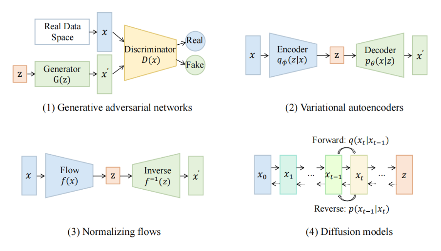

# Stable-Diffusion
stable diffusion Note :alien:

AIGC (Artificial Intelligence Generated Content) 开端 stable diffusion 模型

## 模型

- [Stable Diffusion](https://github.com/CompVis/stable-diffusion)

### 1. 历史追溯

详细论述：[A Comprehensive Survey of AI-Generated Content (AIGC):
A History of Generative AI from GAN to ChatGPT](https://github.com/cvdong/Stable-Diffusion_dong/blob/main/paper/A%20Comprehensive%20Survey%20of%20AI-Generated%20Content.pdf)

四种生成模式，现在比较主流的是diffusion models.