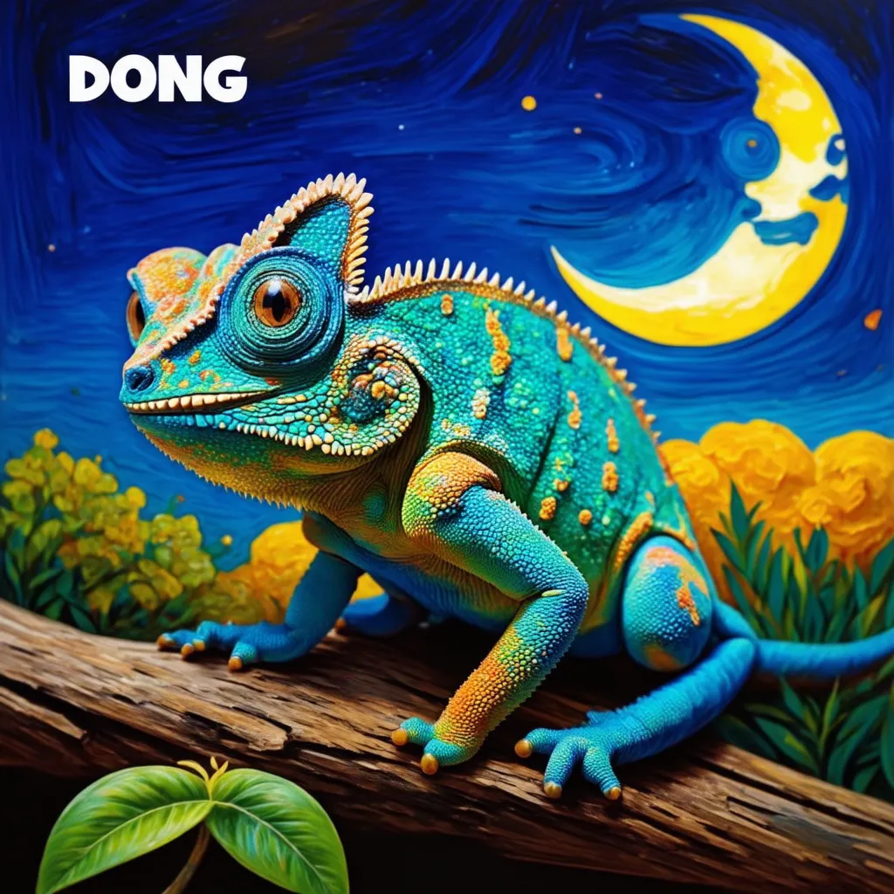

# AIGC (Artificial Intelligence Generated Content)

## **简明 AIGC 教程**

### 第一步：DDPM

[ddpm详解，结合代码理解其内在数学原理](https://github.com/cvdong/Aigc_dong/blob/main/src/ddpm/Generating_flowers_using_DDPMs.ipynb)

### 第二步: SD

### 第三步：Lora

### 第四步：ControlNet

### 第五步：Diffusers

### 第六步：Prompt

### 第七步：Train

### 第八步：Inference

### 第九步：Comfyui

### 第十步：Webui

### 第十一步：TensorRT

### 第十二步：OneDiff

### 第十三步：StreamDiffusion

### 第十四步：LLM

### 第十五步: MLLM

### 第十六步: VLLM

### 第十七步：TRT-LLM

### 第十八步：TritonServer

### 第十九步：HunyuanDit

### 第二十步：T2V

### 第二十一步：K8s

### 第二十二步：Other(IP-Adapter/Omost/flash-diffusion)

### 第二十三步：Project

